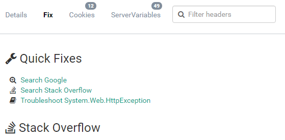

# Elmah.Io.QuickFixes

[](https://ci.appveyor.com/project/ThomasArdal/elmah-io-quickfixes)
[](https://www.nuget.org/packages/elmah.io.quickfixes)

Repository for all quick fixes available on the Fix tab on the elmah.io UI:



## How to contribute

In order to contribute one or more quick fixes, consider the following before creating a pull request. We do accept pull requests adding new quick fixes. Please consider if your quick fix brings value to everyone, before submitting a pull request.

Quick fixes are implemented in C#. To add a new quick fix, create a fork of this repository and create a pull request after adding the code to your fork. Once cloned, create a new C# class in the _Fixes_ folder in the _Elmah.Io.QuickFixes_ project folder. The name of the class should be the action of the quick fix postfixed with _QuickFix_ (like _GenerateFavIconQuickFix_).

Every quick fix needs to extend the `QuickFixBase` class and implement the `CanFix`-method. A quick fix can override the `Decorate`-method, if part of the message must be used for the quick fix text or link.

Let's create a simple quick fix, creating a link to the _Hyper Text Coffee Pot Control Protocol_ article on Wikipedia, on all messages with a status code of 418 (I'm a teapot):

```csharp
using System;

namespace Elmah.Io.QuickFixes.Fixes
{
    public class ImATeapotDocumentationQuickFix : QuickFixBase
    {
        public ImATeapotDocumentationQuickFix()
        {
            Icon = "fa-coffee";
            Url = new Uri("https://en.wikipedia.org/wiki/Hyper_Text_Coffee_Pot_Control_Protocol");
            Text = "One does not simply brew a cup of tea";
        }

        public override bool CanFix(Message message)
        {
            return message.StatusCode.HasValue && message.StatusCode.Value == 418;
        }
    }
}
```

In the constructor, we set the icon to an available icon from [Font Awesome](http://fontawesome.io/) (in this case _fa-coffee_ since no teapot is available in the icon set). The _Url_ and _Text_ properties are set in the constructor as well. In case we needed parts of the `Message` in the URL or text, we would set the value in the `Decorate`-method instead.

The `CanFix`-method is where the fun happens. The method will tell elmah.io if this quick fix should be shown on a message or not. In this case, we return true, if the message has a status code and the value is _418_.

Before creating a pull request, create a unit test of the new quick fix in the _Fixes_ folder in the _Elmah.Io.QuickFixes.Text_ folder. The name of the test must be the same as the quick fix postfixed with _Test_:

```csharp
using Elmah.Io.QuickFixes.Fixes;
using NUnit.Framework;

namespace Elmah.Io.QuickFixes.Test.Fixes
{
    public class ImATeapotDocumentationQuickFixTest
    {
        [TestCase(true, 418)]
        [TestCase(false, 400)]
        [TestCase(false, null)]
        public void CanFix(bool canFix, int? statusCode)
        {
            var quickFix = new ImATeapotDocumentationQuickFix();
            Assert.That(quickFix.CanFix(new Message {StatusCode = statusCode}), Is.EqualTo(canFix));
        }
    }
}
```